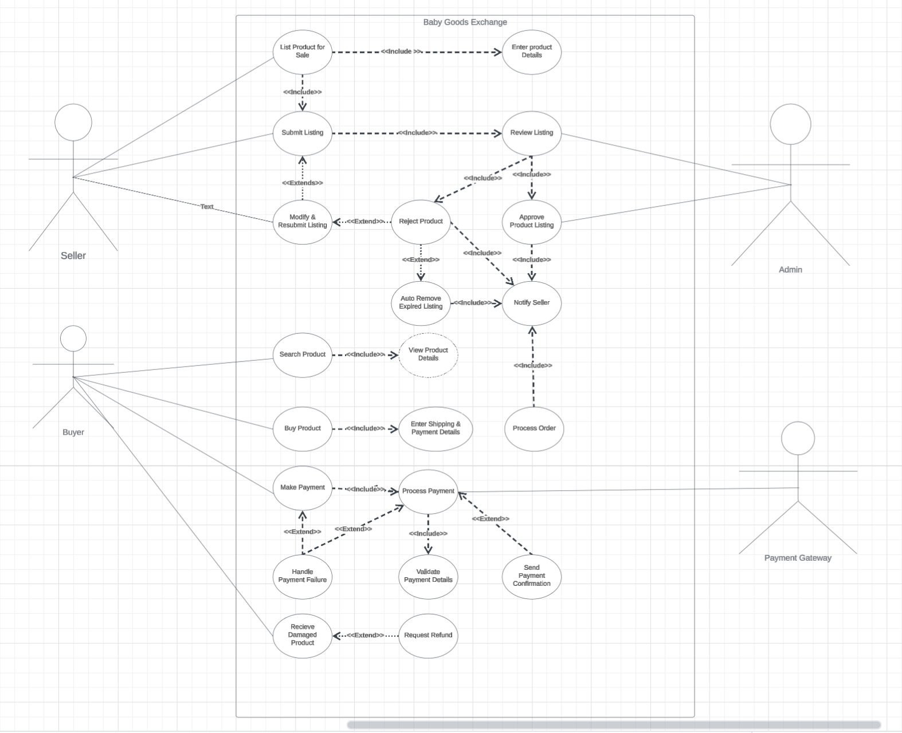
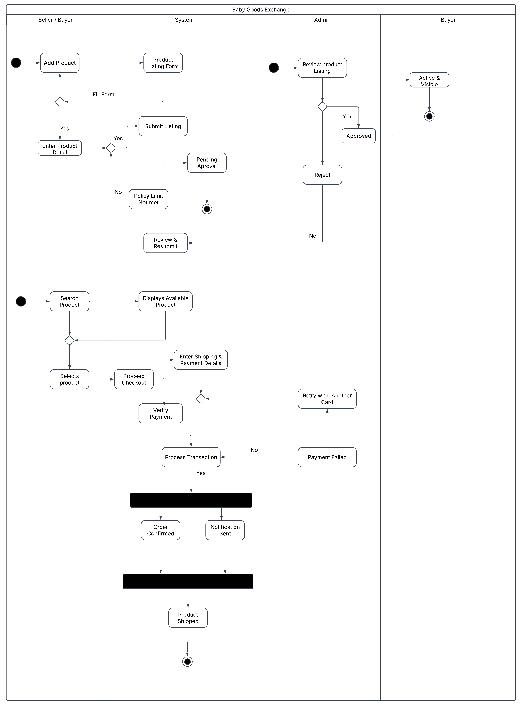
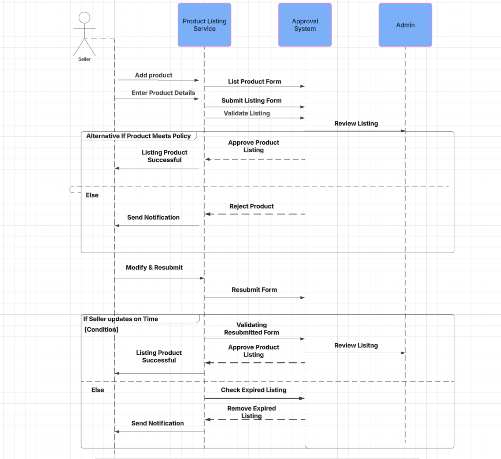

# Project Baby Goods Exchange

## 1. General Project Information

**Project Name:**  
Baby Goods Exchange

### Project Statement
The cost of raising a baby is very high, and many parents struggle to afford essential items. At the same time, families often find themselves with gently used baby products that they no longer need and piled as clutter. This project aims to create an online marketplace where parents can buy, sell, and exchange second-hand or unused baby goods, in a safe, reliable, and affordable way.

This initiative promotes sustainability by reducing waste, supporting families financially, and building a community of parents helping each other.

## 2. Project Objectives

- Develop a user-friendly online platform for parents to list, exchange, donate, or sell baby products.
- Foster a community-driven marketplace with a focus on sustainability and affordability.
- Provide safety guidelines and quality assurance for exchanged goods.
- Implement secure payment and delivery options for convenience.
- Build partnerships with charities to distribute donated baby goods to families in need.

## 3. Project Team

| Role             | Name      | Telephone     | E-mail                  |
|-----------------|-----------|--------------|--------------------------|
| Project Manager | Pema Lama | 646-344-0198 | Pemaomu5@gmail.com       |
| Business Analyst | Zambal D  | 718-222-9848 | Zdorm08@gmail.com        |
| Developer       | Ben Robort | 347-718-212  | Roborta32@gmail.com      |

## 4. Stakeholders

- Parents and caregivers (Primary users of the platform)
- Charitable organizations (Collaboration for donations and promotions)
- Developers and IT Teams (Responsible for platform development and maintenance)
- Marketing Team (Ensuring awareness and engagement through digital campaigns)
- Customer Support Team (Handling user inquiries and disputes)

## 5. Project Scope

### In Scope

- **Platform Development:** A website and mobile app where users can list, browse, and trade second-hand baby products.
- **User Features:** Secure account creation, product listing, search filters, and messaging for buyers and sellers.
- **Payment & Security:** Integration of secure payment gateways and fraud prevention measures.
- **Product Quality & Safety Guidelines:** Clear policies on acceptable items to ensure safe usage for babies.
- **Review & Rating System:** Users can rate and review transactions for trust and transparency.
- **Customer Support:** A help desk to assist users with inquiries and disputes.
- **Marketing & Partnerships:** Collaboration with baby brands, charities, and influencers to grow the community.

### Out of Scope

- **Logistics & Warehousing:** The platform will not handle product storage or shipping; users must arrange their own exchanges.
- **Manufacturing New Products:** The focus is only on second-hand goods, not producing or selling new baby items.
- **International Operations:** Initially, the platform will be limited to a specific country or region.
- **Physical Retail Store:** The project will operate as an online marketplace without a physical storefront.

## 6. Deliverables

- Fully functional Babies Good Exchange platform (website and mobile app)
- Secure payment and transaction system
- Marketing and awareness campaigns
- Partnership agreements with logistics and charity organizations
- Customer support infrastructure

## 7. Project Milestones

- **Project Initiation & Planning** – *March 6, 2025*
- **Platform Development & Testing** – *March 30, 2025*
- **Beta Testing & Soft Launch** – *May 20, 2025*
- **Official Launch & Marketing Campaign** – *June 29, 2025*
- **User Growth & Optimization Phase** – *October 29, 2025*

## 8. Major Known Risks

| Risk | Mitigation Strategy |
|------|---------------------|
| Low user adoption | Strong marketing campaign, incentives for early adopters |
| Quality concerns with exchanged goods | Implement rating system and quality guidelines |
| Logistics challenges | Partner with reliable shipping providers |
| Security and fraud issues | Secure payment gateways and verification process |

## 9. Constraints/Limits

- **Budget Constraint:** Limited funds available for platform development and marketing.
- **Time Constraint:** The platform must launch within six months.
- **Resource Constraint:** A small development team, so only essential features will be built first.
- **Regulatory Constraint:** Following safety laws when selling or exchanging second-hand baby products.
- **Technology Constraint:** Must use an existing e-commerce platform instead of building new software.

## 10. Budget Estimate

**Total:** $10,000

| Expense Category | Estimated Cost % |
|-----------------|-----------------|
| Platform Development | 35% |
| Marketing & Advertising | 20% |
| Logistics & Operations | 15% |
| Customer Support Setup | 10% |
| Miscellaneous & Contingency | 20% |

## 11. RACI

| Task | Responsible | Accountable | Consulted | Informed |
|------|------------|------------|-----------|----------|
| Develop website | IT Developer | Project Manager | UX Designer | Stakeholders |
| Set product safety guidelines | Compliance Officer | Project Sponsor | Legal team | Customers |
| Marketing Campaign | Marketing team | Marketing Sponsor | Social Media Experts | Public |

## 12. Sign-off

| Name | Signature | Date (MM/DD/YYYY) |
|------|----------|------------------|
| **Executive Sponsor** | Pema Lama |  |
| **Project Manager** | Pema Lama |  |

---

## Functional and Non-Functional Requirements for Baby Goods Exchange

### Functional Requirements (What the system must do)

- **User Registration & Login** – Users should be able to sign up and log in securely.
- **Product Listing** – Sellers must be able to upload product details, including images, descriptions, and prices.
- **Search & Filters** – Users should be able to search for products using filters like category, price, and location.
- **Buy & Sell Transactions** – The platform should support secure buying, selling, and product exchanges.
- **Messaging System** – Buyers and sellers should be able to communicate within the platform.
- **Payment Integration** – Secure payment gateways should be available for transactions.
- **Review & Ratings** – Users should be able to leave feedback and rate buyers/sellers.
- **Product Safety Guidelines** – The system should enforce rules for listing only safe and approved baby products.
- **Order Tracking & Notifications** – Users should receive updates on their transactions via email or app notifications.
- **Admin Dashboard** – Administrators should be able to manage users, products, and reported issues.

### Non-Functional Requirements (How the system should perform)

- **Security** – User data and transactions must be encrypted and protected from fraud.
- **Scalability** – The platform should handle a growing number of users and product listings.
- **Performance** – Pages should load within 3 seconds for a smooth user experience.
- **Reliability** – The system should have 99.9% uptime to ensure availability.
- **Usability** – The interface should be easy to navigate for users of all technical levels.
- **Cross-Platform Compatibility** – The system should work on desktop, mobile, and tablet devices.
- **Regulatory Compliance** – The platform should follow consumer safety laws for second-hand baby items.
- **Backup & Recovery** – The system should automatically back up data to prevent loss.
- **Accessibility** – The website should meet WCAG standards (Web Content Accessibility Guidelines) to support users with disabilities.
- **Maintainability** – The system should be easy to update and improve without major downtime.

---

## User Stories

| User Story | Acceptance Criteria |
|------------|----------------------|
| As a parent, I want to search for second-hand baby items so that I can find affordable baby products. | The search bar allows keyword-based searches. Filters for price, category, and condition are available. |
| As a parent, I want to view item details so that I can check the product’s condition before purchasing. | Product details page displays images, descriptions, and seller information. |
| As a buyer, I want to securely pay for a product so that I can complete my purchase safely. | Payment gateway processes transactions securely. Users receive confirmation after payment. |
| As a buyer, I want to contact the seller via chat so that I can ask questions about the product. | Chat feature allows real-time messaging between buyers and sellers. |
| As a seller, I want to list my baby items for sale so that I can declutter and earn money. | Sellers can upload product images and descriptions. Listings require admin approval before going live. |
| As a seller, I want to set a price or enable an exchange option so that I can sell or swap my items. | Users can choose between selling or exchanging an item. Prices can be adjusted before finalizing a sale. |
| As a seller, I want to track my listed items so that I can manage my inventory. | A dashboard shows the status of active, sold, or expired listings. |
| As a buyer, I want to track my order status so that I know when my item will arrive. | Order tracking page displays order status (Pending, Shipped, Delivered). |
| As a seller, I want to receive notifications when my item is sold so that I can arrange for delivery. | Notifications appear for successful sales via app or email. |
| As a buyer, I want to select a delivery or pickup option so that I can choose the most convenient way to receive my item. | Users can select from available delivery methods or schedule a pickup. |

---

## Use Case Document

### Use Case 1: Listing a Baby Product for Sale

- **Unique ID:** UC-1  
- **Primary Actor:** Seller (Parent who wants to sell a product)  
- **Secondary Actor:** System, Admin  
- **Brief Description:** This use case allows a seller to list a baby product for sale on the platform by entering details, uploading images, and submitting the product for approval. The system validates the details, and an admin reviews the listing before it becomes visible to buyers.  
- **Priority:** High  
- **Frequency:** Medium  
- **Trigger:** Seller clicks "Add Product"
- **Pre-condition:** The seller must be logged into their verified account.  
- **Post Condition:** The product is listed and available for buyers to view and purchase.  

#### Happy Path

1. Seller selects "Add Product" option.
2. System displays product listing form.
3. Seller enters product details (title, description, price, condition, images, category).
4. System validates the input fields.
5. Seller submits the listing.
6. System stores the product as "Pending Approval."
7. Admin reviews the listing.
8. Admin approves the product.
9. System publishes the product as Active and visible to buyers.
10. Seller gets a notification.

#### Alternative Path

1. Seller leaves some fields empty → System displays an error message.
2. Admin rejects the listing → System notifies the seller with feedback.
3. Seller modifies and resubmits → System moves it back to "Pending Approval."
4. If seller doesn’t modify in time → System sends a final reminder before deletion.

---

### Use Case 2: Purchasing a Baby Product

- **Unique ID:** UC-2  
- **Primary Actor:** Buyer  
- **Secondary Actor:** System, Payment Gateway  
- **Brief Description:** This use case allows a buyer to search for, select, and purchase a baby product. The buyer enters shipping details, makes a payment, and receives confirmation. The seller then ships the item, and the buyer confirms receipt.  
- **Priority:** High  
- **Frequency:** Frequent  
- **Trigger:** Buyer clicks "Buy Now"
- **Pre-condition:** The buyer must be logged in and the product must be available.  
- **Post Condition:** The transaction is completed successfully or refunded if issues arise.  

#### Happy Path

1. Buyer searches for baby products.
2. System displays available items.
3. Buyer selects a product and clicks "Buy Now."
4. System shows product details and checkout page.
5. Buyer enters shipping details and selects a payment method.
6. System verifies the information.
7. Buyer confirms the purchase and makes payment.
8. System processes payment and updates order status to "Processing."

#### Alternative Path

1. Product is sold out → System displays "Out of Stock" message.
2. Payment fails → System notifies the buyer to retry.
3. Seller cancels the order → System refunds the buyer.
4. Buyer receives damaged product → System allows dispute and refund request.

---
#### Use case Diagram
---

---

#### Activity Diagram
---

#### Sequence Diagram
---

---

# Test Cases

Complete use case diagram and pick 4 different use cases from the use case diagram to create activity diagrams.

| **Test Case ID** | **Test Scenario**                          | **Test Steps**                                                                                                                                              | **Expected Result**                                                                                           | **Actual Result**             | **Status** | **Priority** |
|------------------|--------------------------------------------|-------------------------------------------------------------------------------------------------------------------------------------------------------------|----------------------------------------------------------------------------------------------------------------|--------------------------------|------------|--------------|
| TC_001           | Buyer searches for baby products.         | 1. Go to the home page. 2. Enter a product name in the search bar. 3. Click the search button.                                                        | System displays available baby products matching the search criteria.                                          | To be filled after execution    | Pass/Fail  | High         |
| TC_002           | Buyer selects a product and clicks "Buy Now." | 1. Search for a baby product. 2. Click on the product. 3. Click the "Buy Now" button.                                                                | System displays product details and redirects to the checkout page.                                           | -                              | -          | High         |
| TC_003           | Buyer enters shipping details and selects a payment method. | 1. Enter shipping address details. 2. Choose a payment method. 3. Click "Proceed."                                                                   | System verifies the entered information.                                                                     | -                              | -          | High         |
| TC_004           | Buyer confirms the purchase and makes payment. | 1. Click "Confirm Purchase." 2. Enter valid payment details. 3. Click "Pay."                                                                          | Payment is processed via a secure payment gateway.                                                            | -                              | -          | Critical     |
| TC_005           | System confirms payment success and updates order status. | 1. Complete a successful payment. 2. Check the order status.                                                                                             | System updates order status to "Processing" and notifies the seller.                                          | -                              | -          | High         |
---
-------
-------

# Prototype Website

